# Taskmaster

This is an Android application that manages todo tasks for users, built as a learning exercise for developing on the Android platform. When this app is complete, users will be able to:

- Add tasks
- And more

# Build instructions

To come later.

# Daily Change Logs for Instructor

## Day 1

I added three activities and created buttons to link the main activity to the two other activities.

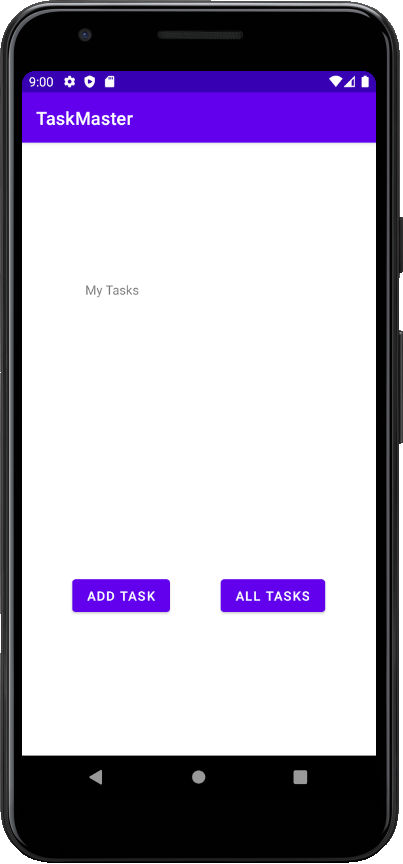
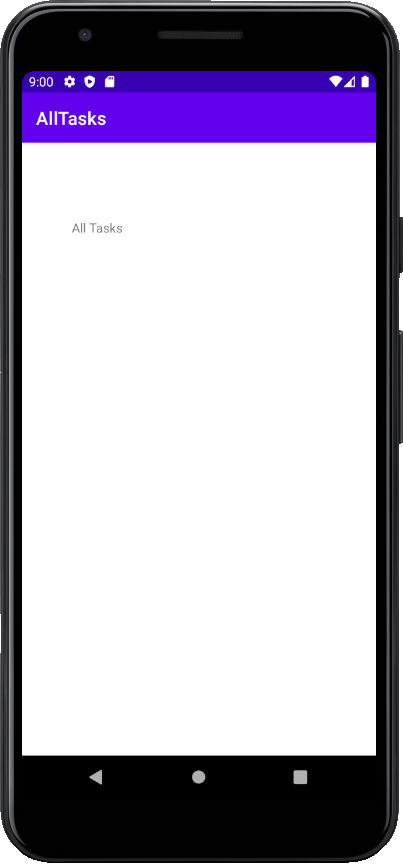
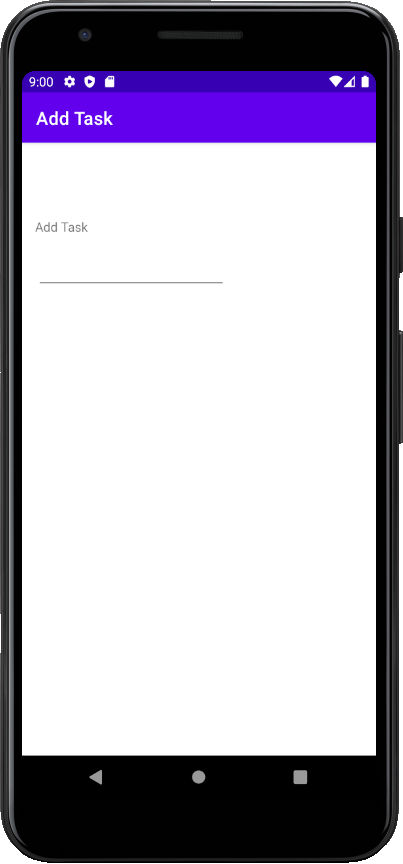

I added view components to the layouts of the activities and adjusted their positions using constraints. String values were added in the `strings.xml` file in the `res` directory. The `AndroidManifest.xml` file was updated to include the new activities created.

## Day 2

I added a task detail view that currently displays a task's name and description.

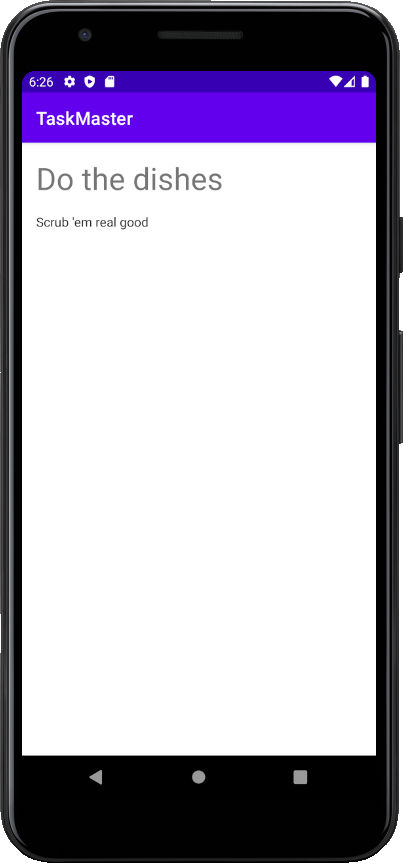

I added a settings activity that allows a user to enter their name and save it.
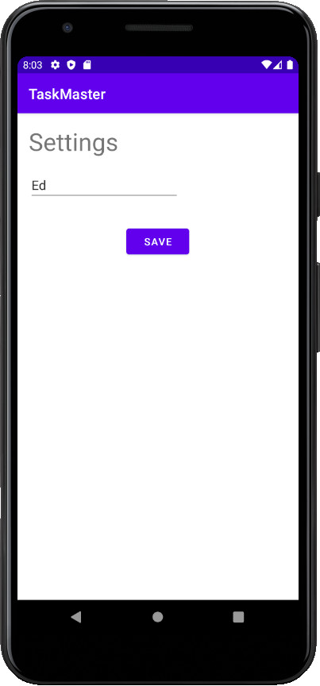

Finally I added a list to the main detail that lists tasks. Currently the data source is a hard coded list.

## Day 3

I implemented a mock database access object that keeps the mock database in memory as a list. Then I created a singleton manager that delivers an instance of the mock database access object to the activities that need it. The main activity needs the mock DAO to populate the RecyclerView list, and the task detail activity needs the mock DAO to populate the task detail view, and the add task activity needs the mock DAO to actually add a new task to the mock database.

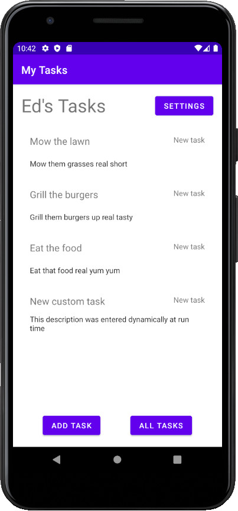
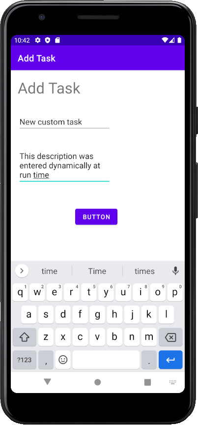

I also added a Task status to my Task model and added some methods to the Status class that render a Status as a string from our string resources file.

## Day 4

I added the real database using Room, by defining my `TasksDao` and `AppDatabase`, and also wrapped all of the database queries in a `TasksRepository` class. I had to implement a Singleton manager pattern in the `AppDatabase` and then added a singleton instance to the `Application` object to make it available to all the activities. Then I replaced all the calls to my `MockListDao` with the real repository and wrapped those calls in coroutines that ran on IO threads to not block the main thread with database queries.

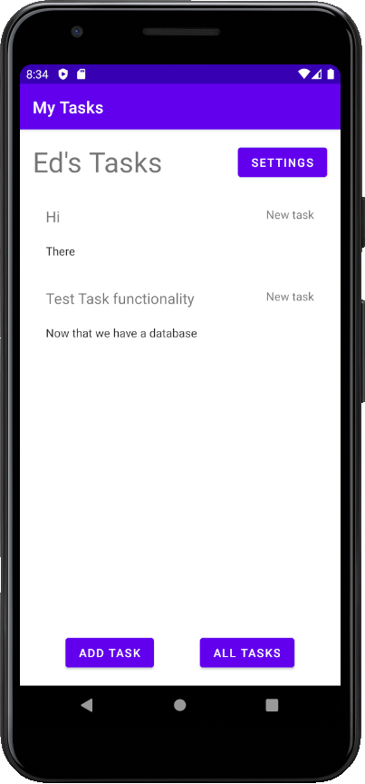

## Day 5

Adding integration testing with Espresso.

## Day 6

Some polishing of the app.

## Day 7

The app now runs on Amplify, connecting to the DynamoDB backend using a GraphQL endpoint and Amplify to build the GraphQL queries.

## Day 8

The app now has teams, and the tasks can be assigned to teams. Users can select which teams they are a part of, and their feed now filters out their tasks by the team that they're a part of.

## Day 9

## Day 10

The app now has a working sign-in workflow, with Sign Up, Confirm, and Sign In activities that call the Amplify auth backend.

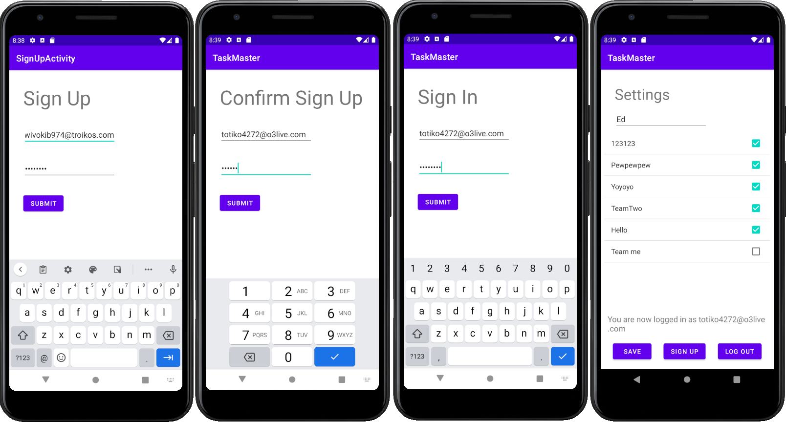

The sign up and sign in buttons are available from the Settings page, and the app displays a text line in the Settings page to indicate whether the user is logged in. Currently the log in is not connected with any other functionality.

## Day 11

The app can upload images for a given task on the task detail page. The image for a task is loaded on the task detail page if it exists.

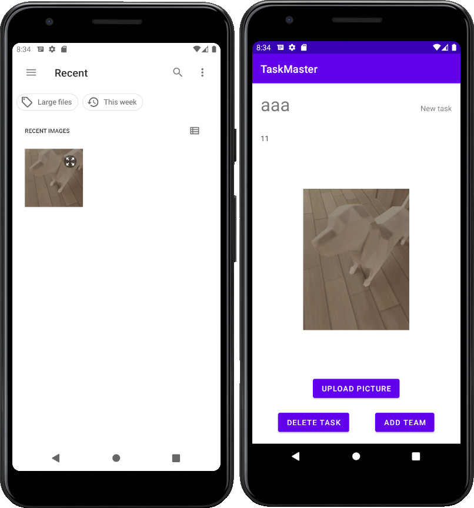

## Day 12

The app can now receive notifications broadcast by Firebase Cloud Messaging. Currently the app makes a toast when a message is received while the app is in the foreground.

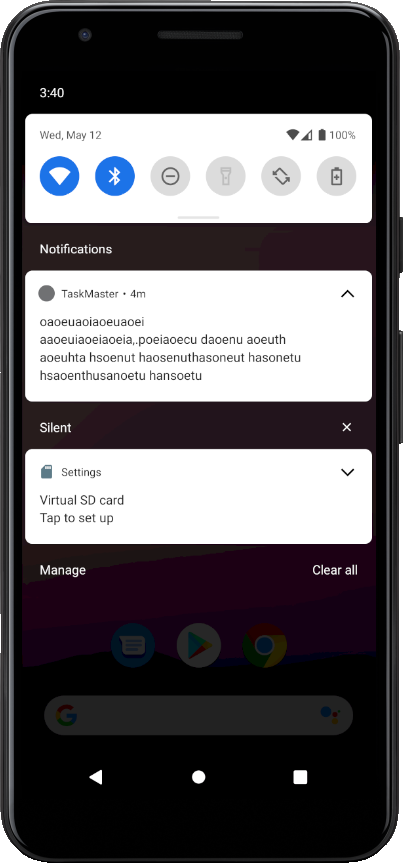
